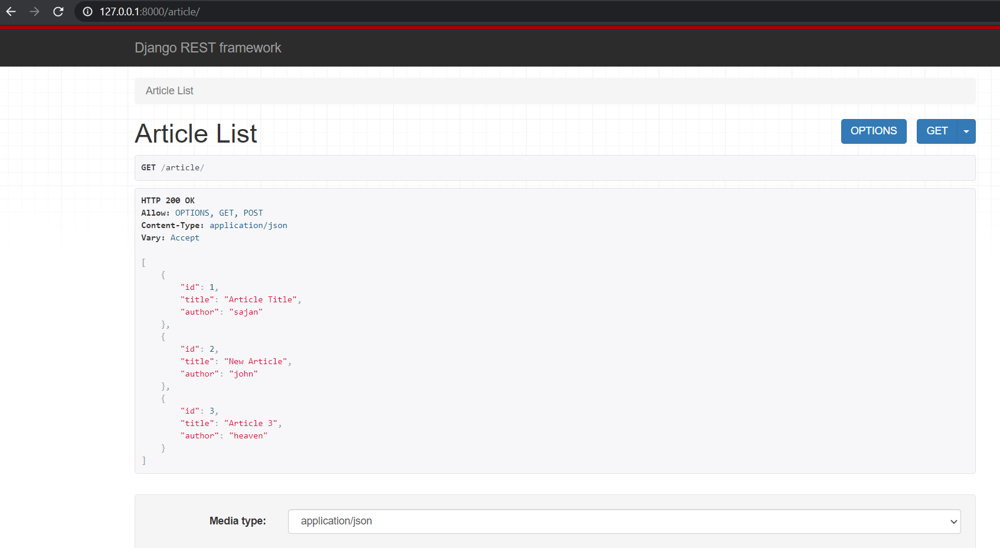

# django_REST_framework

Django REST framework allows us to develop restfull Web APIs. This is an example of building web browse-able api using modal serializers, function based api views.

## Packages
- djangorestframework
- django
- markdown
- django-filter

## Setting up the project
- clone or download the repo
- Use pipenv for virtual environment\
`pipenv install --dev`
- If virtual enviroment is already activated\
`pipenv sync         `
- Or\
`pipenv sync --dev   `

## Browse able api

## Testing 
-use POSTMAN for testing purpose.
